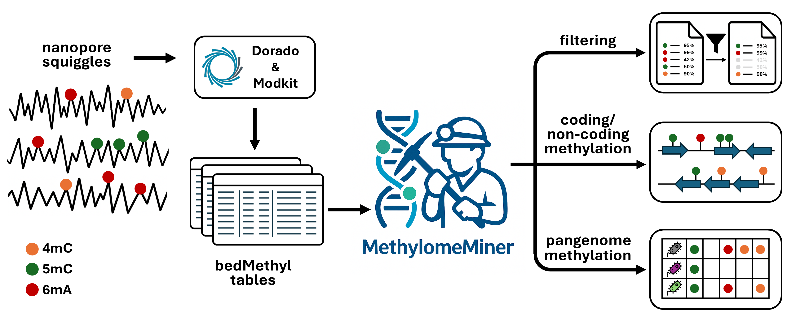

# MethylomeMiner

MethylomeMiner is a tool for handling DNA methylation data in extended bedMethyl format obtained from the nanopore 
sequencing data by [Dorado](https://github.com/nanoporetech/dorado) and 
[Modkit](https://github.com/nanoporetech/modkit).



## Content

- [Features](#features)
- [Installation](#installation)
- [Usage](#usage)
  - [MethylomeMiner](#MethylomeMiner)
  - [PanMethylomeMiner](#pan-methylome-miner)
- [Contact](#contact)

## Features

* Filter bedMethyl tables based on valid coverage and the probability of base modification.
* Sort base modifications into coding and non-coding types using genome annotation.
* Split base modifications according to reference sequences.
* Provide count statistics for each base modification, coding/non-coding types and reference sequence.
* Link coding base modifications with results from pangenome analysis conducted by 
  [Roary](https://sanger-pathogens.github.io/Roary/).

## Installation

1. Create a Python 3.12 or newer virtual environment.
2. Install MethylomeMiner using:

```commandline
python -m pip install methylome_miner
```

## Usage
MethylomeMiner functionality is divided into two parts. The first part named `MethylomeMiner` deals with manipulation
of bedMethyl files, the other, `PanMethylomeMiner`, integrates pangenome analysis with DNA methylation data processed
by MethylomeMiner to create panmethylome.

### `MethylomeMiner`

The primary use of `MethylomeMiner` is to filter out base modifications with low coverage and low probability
of base modification and to sort methylations into coding and non-coding groups. So-called *coding* methylations are
base modifications that are located in some coding region of the genome. On the other hand *non-coding* methylations
are found between coding parts of the genome.

The basic command to run `MethylomeMiner` from command line is following:

```commandline
MethylomeMiner --input_bed_file path/to/bed_file.bed --input_annot_file path/to/annot_file.gff --min_coverage 35
```

#### Required parameters
##### `--input_bed_file`
Path to a bedMethyl file with genome-wide single-base methylation data.

##### `--input_annot_file`
Path to a file with genome annotation in `.gff` (v3) or `.gbk` file format.

##### `--min_coverage` and `--input_bed_dir`
Parameters `--min_coverage` and `--input_bed_dir` are mutually exclusive as they are used to assess the minimum coverage
of base modification to be retained. 

The user can either set the threshold of minimum coverage by using parameter `--min_coverage` and an integer value
of requested coverage, or provide a path to directory with bedMethyl files (`--input_bed_dir` parameter)
and the threshold would be set to the median value of median values of coverage from individual bedMethyl files within
the directory.


#### Optional parameters
##### `--min_percent_modified`
Sets minimum required percentage of reads supporting base modification. The value is float in the range `<0, 100>`.
Default: `90`.

##### `--work_dir`
Specifies the output directory where MethylomeMiner will save all result files.
If not provided, a folder named MethylomeMiner_output will be automatically created in the current working directory.

##### `--file_name`
Specifies a custom name to use for the output files generated by MethylomeMiner.
By default, MethylomeMiner use the name of the input bedMethyl file and add a specific suffix for each output 
(see [Output files](#output-files))

##### `--write_filtered_bed`
A flag. When set, the script writes the filtered bedMethyl data to a new output file in working directory.
Use this option if you want to save the filtered results.

##### `--filtered_bed_format`
Specifies the format of the filtered bedMethyl output file.
Available options: `'json'`, `'csv'`, `'tsv'`, `'bed'`.
Default: `'csv'`.
Use this option to control the format in which the filtered data is saved.

##### `--split_by_reference`
A flag. If set, all output files (except for filtered bedMethyl file) will be split and saved separately for each 
reference sequence.

#### Output files
The output of MethylomeMiner is a set of new files distinguished by file suffixes:
* `_coding.csv` - extended bedMethyl table with information about coding region, where methylations are located.
  
  | reference_seq       | start_index | end_index | modified_base_code | score | strand | ... | percent_modified | ... | gene_reference_seq  | gene_id                            | gene_start | gene_end | gene_strand | gene_product                                   |
  |---------------------|-------------|-----------|--------------------|-------|--------|-----|------------------|-----|---------------------|------------------------------------|------------|----------|-------------|------------------------------------------------|
  | chromosome_contig_1 | 1108        | 1109      | 6mA                | 36    | +      | ... | 94.44            | ... | chromosome_contig_1 | 0792ceb9f153a28951804de2a656f49c_1 | 0          | 1335     | +           | chromosomal replication initiator protein DnaA |
  | chromosome_contig_1 | 1753        | 1754      | 6mA                | 36    | +      | ... | 97.25            | ... | chromosome_contig_1 | 0792ceb9f153a28951804de2a656f49c_2 | 1339       | 2440     | +           | DNA polymerase III subunit beta                |
  | chromosome_contig_1 | 1867        | 1868      | 5mC                | 37    | +      | ... | 100.0            | ... | chromosome_contig_1 | 0792ceb9f153a28951804de2a656f49c_2 | 1339       | 2440     | +           | DNA polymerase III subunit beta                |
  | chromosome_contig_1 | 2699        | 2700      | 6mA                | 36    | +      | ... | 97.25            | ... | chromosome_contig_1 | 0792ceb9f153a28951804de2a656f49c_3 | 2647       | 3721     | +           | DNA replication/repair protein RecF            |
  | chromosome_contig_1 | 2728        | 2729      | 5mC                | 36    | +      | ... | 100.0            | ... | chromosome_contig_1 | 0792ceb9f153a28951804de2a656f49c_3 | 2647       | 3721     | +           | DNA replication/repair protein RecF            |
  | ...                 |

* `_non_coding.csv` - extended bedMethyl table with information about coding regions, that are located in front of and 
  after methylation. Modifications in front of the first coding feature have empty annotation marked as `'prev'` 
  (previous). Modifications after the last coding feature have empty annotation marked as `'next'`.
  
  | reference_seq       | start_index | end_index | modified_base_code | score | strand | ... | percent_modified | ... | prev_gene_reference_seq | prev_gene_id                          | prev_gene_start | prev_gene_end | prev_gene_strand | prev_gene_product                | next_gene_reference_seq | next_gene_id                          | next_gene_start | next_gene_end | next_gene_strand | next_gene_product            |
  |---------------------|-------------|-----------|--------------------|-------|--------|-----|------------------|-----|-------------------------|---------------------------------------|-----------------|---------------|------------------|----------------------------------|-------------------------|---------------------------------------|-----------------|---------------|------------------|------------------------------|
  | chromosome_contig_1 | 1482        | 1483      | 6mA                | 36    | -      | ... | 100.0            | ... |                         |                                       |                 |               |                  |                                  | chromosome_contig_1     | 0792ceb9f153a28951804de2a656f49c_14   | 15874           | 16207         | -                | YceK/YidQ family lipoprotein |
  | chromosome_contig_1 | 1601        | 1602      | 6mA                | 36    | -      | ... | 100.0            | ... |                         |                                       |                 |               |                  |                                  | chromosome_contig_1     | 0792ceb9f153a28951804de2a656f49c_14   | 15874           | 16207         | -                | YceK/YidQ family lipoprotein |
  | ...                 |
  | chromosome_contig_1 | 3553006     | 3553007   | 6mA                | 41    | +      | ... | 97.56            | ... | chromosome_contig_1     | 0792ceb9f153a28951804de2a656f49c_3407 | 3544141         | 3545086       | +                | CDF family zinc transporter ZitB | chromosome_contig_1     | 0792ceb9f153a28951804de2a656f49c_3435 | 3568768         | 3570052       | +                | citrate synthase             |
  | ...                 |
  | plasmid_contig_3    | 153394      | 153395    | 5mC                | 45    | +      | ... | 100.0            | ... | plasmid_contig_3        | 0792ceb9f153a28951804de2a656f49c_5106 | 151555          | 152305        | +                | hypothetical protein             |                         |                                       |                 |               |                  |
  | plasmid_contig_3    | 153396      | 153397    | 5mC                | 36    | -      | ... | 100.0            | ... | plasmid_contig_3        | 0792ceb9f153a28951804de2a656f49c_5099 | 146025          | 146250        | -                | IS1-like element transposase     |                         |                                       |                 |               |                  |                              |
 
* `_all_annot_with_coding_methylations.csv` - extended genome annotation table, where each coding region has
  a list of found methylations' positions distinguished by methylation type.
  
  | record_id           | gene_id                            | start | end  | strand | product                                        | note                                                                                                                                      | 4mC | 5mC                                                          | 6mA                                                    |
  |---------------------|------------------------------------|-------|------|--------|------------------------------------------------|-------------------------------------------------------------------------------------------------------------------------------------------|-----|--------------------------------------------------------------|--------------------------------------------------------|
  | chromosome_contig_1 | 0792ceb9f153a28951804de2a656f49c_1 | 0     | 1335 | +      | chromosomal replication initiator protein DnaA | WP_015703901.1 chromosomal replication initiator protein DnaA (Klebsiella) [pid:94.8%, q_cov:100.0%, s_cov:95.1%, Eval:5.9e-240]          | []  | []                                                           | [1108]                                                 |
  | chromosome_contig_1 | 0792ceb9f153a28951804de2a656f49c_2 | 1339  | 2440 | +      | DNA polymerase III subunit beta                | WP_015369032.1 DNA polymerase III subunit beta (Klebsiella aerogenes) [pid:98.1%, q_cov:100.0%, s_cov:100.0%, Eval:5.2e-204]              | []  | [1867]                                                       | [1753]                                                 |
  | chromosome_contig_1 | 0792ceb9f153a28951804de2a656f49c_3 | 2647  | 3721 | +      | DNA replication/repair protein RecF            | WP_015703900.1 DNA replication/repair protein RecF (Klebsiella aerogenes) [pid:97.5%, q_cov:100.0%, s_cov:100.0%, Eval:1.5e-200]          | []  | [2728, 3115]                                                 | [2699, 2827, 3179, 3640]                               |
  | chromosome_contig_1 | 0792ceb9f153a28951804de2a656f49c_4 | 3749  | 6164 | +      | DNA topoisomerase (ATP-hydrolyzing) subunit B  | WP_015703899.1 DNA topoisomerase (ATP-hydrolyzing) subunit B (Klebsiella aerogenes) [pid:95.1%, q_cov:100.0%, s_cov:100.0%, Eval:0.0e+00] | []  | [3962, 4265, 4307, 4535, 4979, 5012, 5069, 5606, 5825, 5915] | [4454, 4944, 5309, 5406, 5417, 5697, 5991, 6015, 6069] |
  | chromosome_contig_1 | 0792ceb9f153a28951804de2a656f49c_5 | 6365  | 7178 | +      | sugar-phosphatase                              | WP_015369035.1 sugar-phosphatase (Klebsiella aerogenes) [pid:94.8%, q_cov:100.0%, s_cov:100.0%, Eval:1.3e-142]                            | []  | [6857]                                                       | [6696, 6801, 6809, 7023]                               |
  | ...                 |

* `methylations_statistics.csv` - table of filtered methylation counts.

  | 4mC_coding_count | 4mC_non_coding_count | 4mC_total_count | 5mC_coding_count | 5mC_non_coding_count | 5mC_total_count | 6mA_coding_count | 6mA_non_coding_count | 6mA_total_count | total_count |
  |------------------|----------------------|-----------------|------------------|----------------------|-----------------|------------------|----------------------|-----------------|-------------|
  | 38               | 36                   | 74              | 9425             | 10809                | 20234           | 15797            | 16386                | 32183           | 52491       |

* `methylations_statistics_per_reference_sequence.csv`

  | reference_seq       | 4mC_coding_count | 4mC_non_coding_count | 4mC_total_count | 5mC_coding_count | 5mC_non_coding_count | 5mC_total_count | 6mA_coding_count | 6mA_non_coding_count | 6mA_total_count | total_count |
  |---------------------|------------------|----------------------|-----------------|------------------|----------------------|-----------------|------------------|----------------------|-----------------|-------------|
  | chromosome_contig_1 | 33               | 33                   | 66              | 8874             | 10033                | 18907           | 14967            | 15399                | 30366           | 49339       |
  | plasmid_contig_2    | 2                | 1                    | 3               | 252              | 333                  | 585             | 418              | 459                  | 877             | 1465        |
  | plasmid_contig_3    | 3                | 2                    | 5               | 299              | 443                  | 742             | 412              | 528                  | 940             | 1687        |

* `_filtered.*` - optional, filtered bedMethyl table in CSV, TSV, JSON or BED format.

#### Examples
* To run`MethylomeMiner with minimum coverage not specified, but instead path to directory with bedMethyl files is
  provided and minimum coverage is calculated as a median coverage value from all bedMethyl files
  in the directory:

  ```commandline
  MethylomeMiner --input_bed_file input_files\KP825_4mC_5mC_6mA_calls.bed --input_annot_file input_files\KP825_genome.gff --input_bed_dir input_files
  ```
  
* To set minimum coverage and minimum percentage of reads supporting base modification:

  ```commandline
  MethylomeMiner --input_bed_file input_files\KP825_4mC_5mC_6mA_calls.bed --input_annot_file input_files\KP825_genome.gff --min_coverage 36 --min_percent_modified 95
  ```
  
* To setup working directory and custom name for output files:

  ```commandline
  MethylomeMiner --input_bed_file input_files\KP825_4mC_5mC_6mA_calls.bed --input_annot_file input_files\KP825_genome.gff --min_coverage 36 --work_dir path\to\output_dir --file_name output_file_name_prefix
  ```

* To write filtered bedMethyl table to default csv file:

  ```commandline
  MethylomeMiner --input_bed_file input_files\KP825_4mC_5mC_6mA_calls.bed --input_annot_file input_files\KP825_genome.gff --write_filtered_bed
  ```

* To write filtered bedMethyl file and select its format:

  ```commandline
  MethylomeMiner --input_bed_file input_files\KP825_4mC_5mC_6mA_calls.bed --input_annot_file input_files\KP825_genome.gff --write_filtered_bed --filtered_bed_format bed
  ```

* To split and save all output files (except for filtered bedMethyl file) by reference sequences:

  ```commandline
  MethylomeMiner --input_bed_file input_files\KP825_4mC_5mC_6mA_calls.bed --input_annot_file input_files\KP825_genome.gff --split_by_reference
  ```

